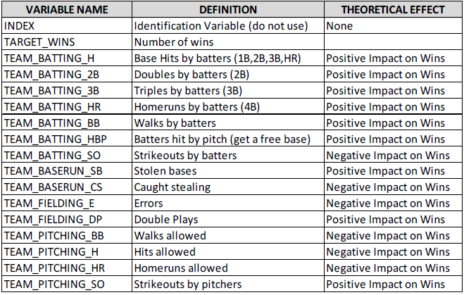

```{r, message=FALSE,warning=FALSE}
# loading libraries
library(tidyr)
library(tidyverse)
library(knitr)
library(kableExtra)
library(DT)
library(reshape2)
library(naniar) # for missing values
library(corrplot) # for plotting correlation matrix
library(imputeTS)
library(e1071) # To check skewness
library(caret)
library(jtools)
library(VIM) # Prints out the summary table of lm in a pretty way using summ() function
library(performance) # This package is to use check_model() for performance of model
library(see) # This packages is also used to support check_model()
```


# Introduction


```{r}

```


```{r, message=FALSE, warning=FALSE}
train <- read_csv('https://raw.githubusercontent.com/habibkhan89/Data621/master/Homework%201/moneyball-training-data.csv', col_names = TRUE)[,-1] 
test <- read_csv('https://raw.githubusercontent.com/habibkhan89/Data621/master/Homework%201/moneyball-evaluation-data.csv',col_names=TRUE)[,-1] 

# Renaming the column names to make them less complicated
colnames(train) <- gsub("TEAM_", "", colnames(train))
colnames(test) <- gsub("TEAM_", "", colnames(test))

```


# Data Exploration


```{r}
print(train)
summary(train)
```

```{r, warning=FALSE, message=FALSE}
# Boxplot
ggplot(data = melt(train), aes(x=variable, y=value)) + geom_boxplot(aes(color=variable)) + coord_flip() + labs(title="BoxPlot for all variables")

# Skewness and outliers
ggplot(melt(train), aes(x=value))+geom_density()+facet_wrap(~variable, scales='free')
```
```{r}
# CHecking for missing values
sapply(train, function(x) sum(is.na(x)))
vis_miss(train) # From naniar library
gg_miss_var(train)+ labs(title="Visual Summaries of Missing Data")
```
```{r}
# Creating Correlation Plot among the variables
train %>% cor(., use="pairwise.complete.obs", method = "pearson") %>% corrplot(.,method = "color", type= "upper", tl.col="black", diag=TRUE , number.cex = 0.5, addCoef.col = 'black', tl.srt=90)
```

```{r, warning=FALSE, message=FALSE}
train %>% gather(variable, value, -TARGET_WINS) %>% ggplot(., aes(value, TARGET_WINS))+geom_point()+geom_smooth(method="lm")+
  facet_wrap(~variable, scales="free")+ labs(title="Relationship between Predictors and TARGET_WINS")
```


# Data Preparation

BATTIMT_HBP has 92 percent missing values out of it's overall data that's why it is essential to remove it out of model. 

## Model 1 - Basic Model

This model is created through removing basic extreme outliers from PITCHING_H and PITCHING_SO. Also, BATTING_HBP had 92% missing values that's why it was removed from the basic model. 

In this model, we are simply going to replace the missing values for each column with their median. 

```{r}
# Replacing extreme values with median for training & evaluation datasets and removing BATTING_HBP which has 92% missing values
train2 <- train %>% mutate(PITCHING_H = if_else(PITCHING_H > 5000, median(PITCHING_H), PITCHING_H),
                            PITCHING_SO = if_else(PITCHING_SO > 1500, median(PITCHING_SO), PITCHING_SO)) %>% 
  select(-BATTING_HBP)

test2 <- test %>% mutate(PITCHING_H = if_else(PITCHING_H > 5000, median(PITCHING_H), PITCHING_H),
                            PITCHING_SO = if_else(PITCHING_SO > 1500, median(PITCHING_SO), PITCHING_SO)) %>% 
  select(-BATTING_HBP)


```


All the missing values were replaced by the median of it's column. Most of the variables don't have extreme outliers but still it has some sort of skewness but I won't remove them because it might change the model's fitness. We will fix the model in next steps and check which model performs better. Variables like PITCHING_H and PITCHING_BB are skewed significantly which we have to transform in next models. 

```{r}
# Replacing missing values with median
train2[] <- lapply(train2, function(x) ifelse(is.na(x), median(x, na.rm=TRUE), x))
test2[] <- lapply(test2, function(x) ifelse(is.na(x), median(x, na.rm=TRUE), x))


# Verifying for missing values
sapply(train2, function(x) sum(is.na(x)))
vis_miss(train2) # From naniar library

# Checking skewness
sapply(train2, function(x) skewness(x))
```

## Model 2 - Log Transformation

In this model, we are going to use log transformation method which makes skewed distributed into normally distributed shape. Skewness got comparatively much better after applying log transformation on highly skewed variables. We have to apply log transformation in both training and test datasets to make sure consistency in both datasets. We used log10 from base model and added 1 on each skewed variable because there was lots of 0s in the data and log transformation cannot be applied on dataset if it has 0s. For that reason, it is recommended to add 1 to avoid that issue. Following 5 variables were highly skewed that's why we applied log transformation on these. Skewness is comparatively much better now as it was in previous model. 

```{r}
train_log <- train2 # Model 2
test_log <- test2

# Applying log transformation for highly skewed variables
#training
train_log$PITCHING_BB <- log10(train_log$PITCHING_BB + 1)
train_log$PITCHING_H <- log10(train_log$PITCHING_H + 1)
train_log$FIELDING_E <- log10(train_log$FIELDING_E + 1)
train_log$BASERUN_SB <- log10(train_log$BASERUN_SB + 1)
train_log$BASERUN_CS <- log10(train_log$BASERUN_CS + 1)
#test
test_log$PITCHING_BB <- log10(test_log$PITCHING_BB + 1)
test_log$PITCHING_H <- log10(test_log$PITCHING_H + 1)
test_log$FIELDING_E <- log10(test_log$FIELDING_E + 1)
test_log$BASERUN_SB <- log10(test_log$BASERUN_SB + 1)
test_log$BASERUN_CS <- log10(test_log$BASERUN_CS + 1)


# CHecking skewness
sapply(train_log, function(x) skewness(x))

# Printing summary statistics
summary(train_log)

# Skewness
ggplot(melt(train_log), aes(x=value))+geom_density()+facet_wrap(~variable, scales='free')

```


## Model 3 - BoxCox Transformation

In this model, we are going to use preProcess() function from caret's package which not only applies BoxCox transformation but also makes the data much better through different methods but in this case we specified to apply boxcox along with center and scale. It simply means that we want to subtract the mean of predictor's data from predictor's values while scale divides by the standard deviation. I was hoping this model to perform better but seems like skewness did not dropped absolutely as good as it did with log transformation. We will see performance of the model in next step. 

```{r}
# Converting tibble to df
train_data_bx <- data.frame(train2) 
test_data_bx <- data.frame(test2)

dim(test2)
# PreProcess function for boxcox transformation
preproc_value <- preProcess(train_data_bx[,-1], c("BoxCox", "center", "scale"))

# Transformation
train_bx_transformed <- predict(preproc_value, train_data_bx)
test_bx_transformed <- predict(preproc_value, test_data_bx)

# Normality and skewness
ggplot(melt(train_bx_transformed), aes(x=value))+geom_density()+facet_wrap(~variable, scales='free')
sapply(train_bx_transformed, function(x) skewness(x))
```

## Model 4 - knn Imputation on missing values

In model 4, we are going to replace the missing values with knn using Caret library's preProcess function. We decided to remove BATTING_HBP and BASERUN_CS as they had 92% and 33% missing values respectively. We want to see if knnImputation with other selected variables might give better results. After imputation, we will use log transformation again with knn imputed values to see if it will cause any difference in the model. Few data scientists suggest to use knn imputation to replace missing values rather than median or mean. Again for consistency, we have to apply all transformation on both training and datasets 

```{r}
set.seed(1100)
library(VIM)

# knn imputation for missing values
# training
train_data_knn <- train %>% # TRAINING 
  select(-BATTING_HBP, -BASERUN_CS) 
train_knn <- kNN(train_data_knn, variable = c("BATTING_SO", "BASERUN_SB", "PITCHING_SO","FIELDING_DP"),k=6)

#test
test_data_knn <- test %>% # TEST
  select(-BATTING_HBP, -BASERUN_CS) 
test_knn <- kNN(test_data_knn, variable = c("BATTING_SO", "BASERUN_SB", "PITCHING_SO","FIELDING_DP"),k=6)

# CHecking for missing values
colSums(is.na(train_knn))

# Log transformation on knn imputed dataset
train_knn_log <- train_data_knn # Model 2
test_knn_log <- test_data_knn
#test_log <- test2

# Applying log transformation for highly skewed variables
#training
train_knn_log$PITCHING_BB <- log10(train_knn_log$PITCHING_BB + 1)
train_knn_log$PITCHING_H <- log10(train_knn_log$PITCHING_H + 1)
train_knn_log$FIELDING_E <- log10(train_knn_log$FIELDING_E + 1)
train_knn_log$BASERUN_SB <- log10(train_knn_log$BASERUN_SB + 1)

# TEST DATASET TRANSFORMATION
test_knn_log$PITCHING_BB <- log10(test_knn_log$PITCHING_BB + 1)
test_knn_log$PITCHING_H <- log10(test_knn_log$PITCHING_H + 1)
test_knn_log$FIELDING_E <- log10(test_knn_log$FIELDING_E + 1)
test_knn_log$BASERUN_SB <- log10(test_knn_log$BASERUN_SB + 1)

# CHecking skewness and normality
sapply(train_knn_log, function(x) skewness(x))
ggplot(melt(train_knn_log), aes(x=value))+geom_density()+facet_wrap(~variable, scales='free')
```


# Build Models


## Model 1 

```{r}
model1 <- lm(TARGET_WINS ~ ., train2)
#summary(model1)
summ(model1)
```
First of all the significance of the model is significant as per the p-value of F-statistics. It means that overall the model is significant. Adjusted r2 is 0.32 which means these variables accounts 32% of TARGET_WINS. All the variables other than BASERUN_CS and PITCHING_SO are insignificant. BASERUN_CS has 33% missing values which should have negative impact and it has negative but insignificant. It means Caught Stealing and it does not impact the chances of winning significantly. PITCHING_SO means strikeouts by pitchers which also has insigificant impact on TARGET_WINS. BATTING_2B should have positive impact but in model it shows significant but with very little coefficient.  BATTING_HR means homeruns by batters should've and have positive impact on chances of winning. BATTING_BB means walks by batter. It should have positive impact but in our model it has insignificant impact. BATTING_SO means strikeouts by batters which shoul've negative impact but in our model it does not play significant role. BASERUN_SB should've significant impact and it has positive role. BASERUN_CS, PITCHING_HR and PITCHING_SO have insignificant impact while PITCHING_H, PITCHING_BB, FIELDING_E and FIELDING_DP have significant roles. 

$$
TARGET_WINS = 19.02 + BATTING_H(0.04) - BATTING_2B(0.02) + BATTING_3B(0.07) + BATTING_HR(0.09) + BASERUN_SB(0.03) + PITCHING_H(0.01) + PITCHING_BB(0.01) - FIELDING_E (0.03) - FIELDING_DP(0.11)
$$


## Model 2


```{r}
model2 <- lm(TARGET_WINS ~ ., train_log)
summ(model2)
```
Adjusted-r2 did not improve overall as compared with model 1 and intercept is insignificant in this model which shows that the other variables which were not included in this model are not important. If that's the case the adjusted r-square should've improved as compared with model 1. We are not going to prefer this model and also some of variables have become insignificant which were not before. 

## Model 3

```{r}
model3 <- lm(TARGET_WINS ~ ., train_bx_transformed)
summ(model3)
```
With boxcox transformation, intercept is now again significant but adjusted r-square dropped a little. I would prefer to look at the model at this time rather than merely depending on r-square or adjusted r-square's values. BASERUN_CS, PITCHING_HR, PITCHING_BB and PITCHING_SO are still insignificant here which are almost consistent with model 2. 

## Model 4

```{r}
model4 <- lm(TARGET_WINS ~ ., train_knn_log)
summ(model4)
```
Seems like knn-imputation along with log transformation did improve the adjusted r-square from 0.33 to 0.42 which means it's better now. As I discussed merely depending upon adjusted r-sq is not a good idea and we have to dig in the model if results actually mean in reality or not. According to new model BATTING_HR is insignificant all the other variables are significant at 10 % confidence interval which means result did improve here. BATTING_2B is negative though but consistent with all models but to very low extent. BATTING_SO is negative impacting which makes sense. PITCHING_H, PITCHING_BB and PITCHING_E have also negative impact which totally makes sense. 

Our model will be:
$$
TARGET_WINS = 154.048 + BATTING_H (0.05) - BATTING_2B (0.04) + BATTING_3B (0.10) + BATTING_BB (0.04) - BATTING_SO (0.02) + BASERUN_SB (12.89) - PITCHING_H (9.25) + PITCHING_HR (0.08) - PITCHING_BB (9.83) + PITCHING_SO (0.00) - FIELDING_E (46.98) - FIELDING_DP (0.14)
$$


# Select Model

As discussed I would prefer to selecting Model 4 because not only it improved adjusted r-square but also the intercept also has become significant which was not the case in model 3. Also, the significance and directions of each variable's impact on TARGET_WINS make totally sense. We came to find that knn imputation along with log transformation improved the model significantly as compared with other variables. It also shows that we cannot randomly just replace the missing values with mean or median. We hvae to check our model with different criteria to see which transformation techniques do well overall in terms of not only r-square but also we have to see if the result actually makes sense or not. At this point we are convinced about performance of model 4 but we'll take one step extra and double check. 

```{r, warning=FALSE, message=FALSE}
# Checking the overall performance of model
model_test <- lm(TARGET_WINS ~ BATTING_H + BATTING_2B + BATTING_3B + BATTING_BB + BATTING_SO + BASERUN_SB + PITCHING_H + PITCHING_HR + PITCHING_BB + PITCHING_SO + FIELDING_E + FIELDING_DP, data=train_knn_log)
check_model(model_test)
```
Data looks normally distributed but looks like there are high collinearity among some of the variables as shown below which might be affect their significance or coefficients in final model. According to Jim Frost, multicollinearity does not influence the predictions, precision and goodness of fit. He adds that if primary goal is to make predictions then you do not have to understand the role of each independent variable.  There is some homoskedasticity in residuals as shown in graph 2 in second row. 


```{r}
# CHecking multicollinearity
check_collinearity(model_test)

# Checking model performance
model_performance(model_test)
```

It seems that model 4's performance is almost consistent with other models in terms of collinearity and RMSE but adjusted r2 is comparatively better than others. Also, the results make sense too practically so I would select model 4. 


# References

https://easystats.github.io/performance/

https://statisticsbyjim.com/regression/multicollinearity-in-regression-analysis/#:~:text=Multicollinearity%20makes%20it%20hard%20to,a%20way%20to%20fix%20multicollinearity.